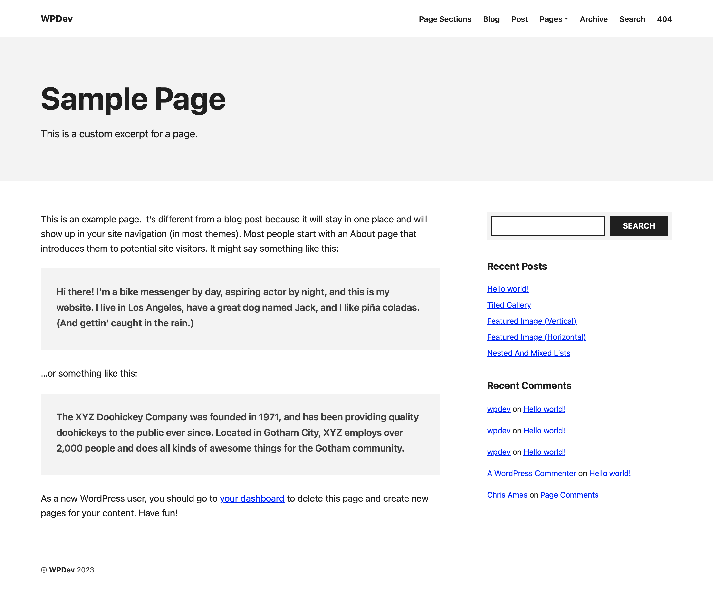

# WordPress Starter Theme

This is a starter theme for WordPress. It is based on the classic [underscores.me](https://underscores.me) starter theme, though several things have been changed, added, or removed.

**NOTE: This theme is meant for you to download and customize (if needed) for your own project. Limited support will be provided, other than fixing obvious bugs, typos, or adding necessary features. No updates are pushed directly to users. Each download exists as a snapshot in time.**

## Development Setup

This theme uses [Node.js](https://nodejs.org/en/) and [Grunt](https://gruntjs.com) to manage dependencies and compile Sass, minify CSS and JS, and update the .pot file.

1. Install [Node.js](https://nodejs.org/en/) on your machine if you haven't already.
2. Install and activate the theme in WordPress.
3. Run `npm install` in the theme root directory to install dependencies.
4. Run `grunt watch` to automatically compile Sass, minify CSS and JS while working on the theme styles and scripts.
5. Run `grunt pot` to update the .pot file.

## Design Features

* Includes Bootstrap (CSS) utilities, grid, and reboot
* Includes Wide page template (page-width content column, no sidebar)
* Includes Narrow page template (centered, narrow content column, no sidebar) 
* Includes Page Sections page template (CSS optimized to use the Group block as a full-width page section with constrained content inside)
* Includes blog template (home.php)
* Customizable page headers via WordPress core functionality (title and excerpt), custom page header function parameters in individual templates, or Advanced Custom Fields settings per page
* Desktop menu with drop-down support and mobile menu with expandable sub-menus on click
* Centered blog post layout with no sidebar for easy reading
* Condensed search results page layout
* Color scheme options in the Customizer, available for use in the Block Editor

### Customizer Options

The theme includes color scheme options in the Customizer. Set the body text, subdued body text, light background, dark background, and action colors to easily change the theme's general color scheme.

Once set in the Customizer, these colors are available for use in the Block Editor.

### Styles and Scripts

With the theme activated and having run `npm install`, you may now run `grunt watch` in the theme root directory to automatically compile Sass, minify CSS and JS while working on the theme styles and scripts.

Styles and scripts should be edited in the `assets/css/src` and `assets/js/src` directories, respectively. The `assets/css` and `assets/js` directories are where the compiled and minified files are automatically placed. Any styles or scripts that you do not want to be compiled or minified should be placed directly in the `assets/css` and `assets/js` directories, respectively (or anywhere you want outside the `src` directories).

The `assets/css/styles.scss` and `assets/css/editor-styles.scss` files are the main Sass files that import all other Sass files. These files are then compiled to `style.css` and `editor-style.css`, respectively, and used for the theme.

The `assets/js/scripts.js` file is compiled from all files in the `assets/js/src` directory. This file is then minified to `assets/js/scripts.min.js` and used for the theme.

### HTML structure

The theme uses the [Bootstrap](https://getbootstrap.com/docs/5.3/layout/grid/) Grid system for layouts. The `.container`, `.row`, and `.col` classes are used throughout the theme to give structure.

However, the theme also has its own `.inner` class that provides vertical structure, best for creating page sections. A page section, in this context, is a horizontal section of the page that spans the entire width of the viewport. However, the content within the section is constrained to the page width. This works by combining the theme class with the Bootstrap classes. Example:

```html
<!-- Wrapper class - spans full viewport width -->
<section class="generic-section">

    <!-- Vertical structure class - adds vertical padding to page sections -->
    <div class="inner">

        <!-- Bootstrap Grid class - keeps content horizontally constrained -->
        <div class="container">

            <!-- Bootstrap Grid class - flex container -->
            <div class="row">
                
                <!-- Bootstrap Grid classes - flex items -->
                <div class="col-12 col-lg-6">
                    <p>Left column content</p>
                </div>
                <div class="col-12 col-lg-6">
                    <p>Right column content</p>
                </div>
                
            </div>
            
        </div>
        
    </div>
    
</section>
```

The `.generic-section` element is the page section. The `.inner` element is the vertical structure. The `.container`, `.row`, and `.col` elements are the Bootstrap Grid system.

The `.inner` class also supports additional (optional) class modifiers to adjust the vertical padding. Those classes are `.tiny`, `.small`, `.medium`, `.large`, and `.huge`.

`<div class="inner tiny">` would create a relatively small page section while `<div class="inner huge">` would create a very large page section.

### Block Editor (Gutenberg) Page Sections

The above HTML structure is only achievable when you are the HTML author. However, the theme includes a style system which allows you to place a **Group** block into the *Page Sections* page template and the default structure of the block will inherit the page section style. No classes need to be added to the block for this to work. The Group block simply needs to:

1. Be placed in the *Page Sections* page template
2. Be a *top-level **Group** block* in the Content area

Anything you place *inside* the top-level Group block will use default styling with no adjustments, including nested Group blocks.

With this HTML structure and style system in place, you have the freedom to create custom theme templates using the style system, or create the same in the block editor with the Page Sections template.

*NOTE: If using the Page Sections template, the top-level Group block can also take advantage of the `.inner` class modifiers to adjust the vertical padding.*

### Page Headers

The theme includes a page header template part that can be used in any template file. It is designed to display a more robust page header beneath the site header on various site pages.

Inside a standard template file, you may see the following code to display the site header and page header:

```php
get_header();
get_template_part( 'template-parts/section', 'page-header' );
```

This results in the following visual output at the top of this sample page:



This is a dynamic page header that can be customized in several ways and across multiple templates. The `get_template_part()` call accepts arguments so that you can customize the title and description for each page. For example, the following code displays the post title and excerpt (if it exists) on a single blog post:

```php
get_template_part( 'template-parts/section', 'page-header', array(
	'title' => get_the_title(),
	'description' => has_excerpt() ? get_the_excerpt() : '',
) );
```

However, an archive page has slightly different needs:

```php
get_template_part( 'template-parts/section', 'page-header', array(
	'title' => get_the_archive_title(),
	'description' => get_the_archive_description(),
) );
```

How about the blog home template (home.php)? It should display the page title and excerpt, or perhaps a custom title and description from Advanced Custom Fields if they exist: 

```php
$title = get_the_title( get_option( 'page_for_posts' ) );
$description = get_the_excerpt( get_option( 'page_for_posts' ) );

if ( class_exists( 'acf' ) ) {

	if ( get_field( 'page_header_title', get_option( 'page_for_posts' ) ) ) {
		$title = get_field( 'page_header_title', get_option( 'page_for_posts' ) );
	}

	if ( get_field( 'page_header_description', get_option( 'page_for_posts' ) ) ) {
		$description = get_field( 'page_header_description', get_option( 'page_for_posts' ) );
	}
}

get_template_part( 'template-parts/section', 'page-header', array(
	'title' => $title,
	'description' => $description,
) );
```

The template part is used throughout the theme in a logical manner and is ready to be customized for any template file you decide to create.

## Advanced Custom Fields

The aforementioned Page Header functionality is ready for use with [Advanced Custom Fields](https://advancedcustomfields.com/) (ACF) plugin. ACF can be used in any other way you'd like, but the theme includes a few custom fields that are ready to be used right out of the box. It works with both the [free](https://wordpress.org/plugins/advanced-custom-fields/) version and the pro version.

With either version of ACF activated, you can import the following `.json` file to create a new Field Group called **Page Settings** which includes a single Tab for **Page Header** and fields for `page_header_title` and `page_header_description`. These field values can then be used in the page header template part arguments to customize the page header title and description.

**[Download Page Settings JSON for ACF](assets/Page-Settings-ACF-Export.json)**

On site **pages** that are editable from the WordPress dashboard, you'll see a new **Page Settings** metabox. This metabox allows you to customize the page header title and description for any page. 

*Note: The Field Group is set to only display on WordPress pages, and only if the page *does not* use the Page Sections page template. If a page header is desired in the Page Sections template, it should be build in the block editor itself.*

## Theme Issues

If you encounter any issues with the theme, please [open an issue](https://github.com/SeanTOSCD/wordpress-starter-theme/issues). Please include as much information as possible, including:

- WordPress version
- PHP version
- Browser version
- Steps to reproduce the issue
- Screenshots
- Error messages
- Any other relevant information